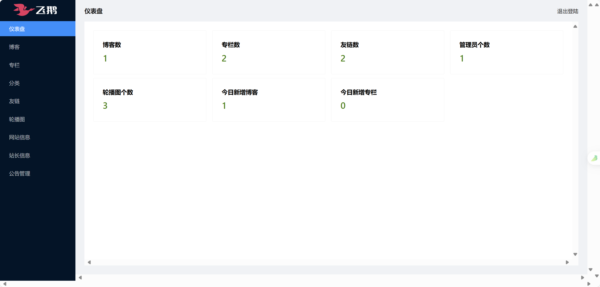

<h1 align='center' style='color: #0984e3'>UKnow博客服务端 </h1>


## 介绍

此服务端项目 fork 自[飞鸽博客 flygoose-api](https://github.com/helloworld-Co/flygoose-api) 并进行了二次开发，欢迎一起学习

项目使用 Go 语言开发的，需要安装 Go 语言环境，这里推荐一个 SDK 多版本管理工具 [vfox](https://vfox.lhan.me/zh-hans/) ，可以轻松切换 Go 版本

博客前台：[https://github.com/small-universe/flygoose-blog](https://github.com/small-universe/flygoose-blog)

博客后台：[https://github.com/small-universe/flygoose-blog-admin](https://github.com/small-universe/flygoose-blog-admin)


## 技术栈

1. 编程语言：Go 1.22+
2. Web框架：[Iris](https://www.iris-go.com/)
3. 数据库：MySQL 8.0+、SQLite3、PostgreSQL 三选一
4. 部署工具：Docker、Docker-Compose


## 开发计划

- [x] 支持 SQLite 数据库
- [x] 支持 Docker 部署
- [ ] 博客后台，文章中图片上传功能不可用（考虑更换组件）
- [ ] 文章导入导出功能
- [ ] 博客备份功能
- [ ] 评论功能


## 本地项目运行

### 克隆项目

```bash
git clone https://github.com/small-universe/flygoose-api.git
# 或
git clone https://gitee.com/small-universe/flygoose-api.git
```

### 安装依赖

进入到根目录下执行如下命令

```bash
go mod tidy
```

### 运行

本地IDE中运行，执行如下命令

```bash
go run main.go
```

### 运行效果展示

|                           博客首页                           |                           博客后台                           |
| :----------------------------------------------------------: | :----------------------------------------------------------: |
|  |  |
|                             文章                             |                             专栏                             |
|  |  |

## Docker 部署

在执行如下步骤之前，请先安装 `docker-desktop`

以 Windows 用户为例：[Windows安装Docker Desktop，详细步骤](https://juejin.cn/post/7404858270509121588)

### 构建 Docker 镜像

如有必要，可以重新修改一下 `scripts/build.sh` 中相关配置

```bash
#版本
version=XXX 
# 镜像名
image_name=XXX
```
接着执行如下命令即可
```shell
cd ./scripts
sh build.sh
```

### 启动 Docker 容器

使用 `docker-compose` 在本地启动应用，执行如下命令，这可以验证上一步构建的镜像是否可用

```bash
cd ./scripts
docker-compose up -d
```

### Docker 镜像上传

- [ ] 上传阿里云


## 原生部署

可以参考飞鸽官方文档：[飞鹅博客如何部署](https://www.helloworld.net/p/4790426995)